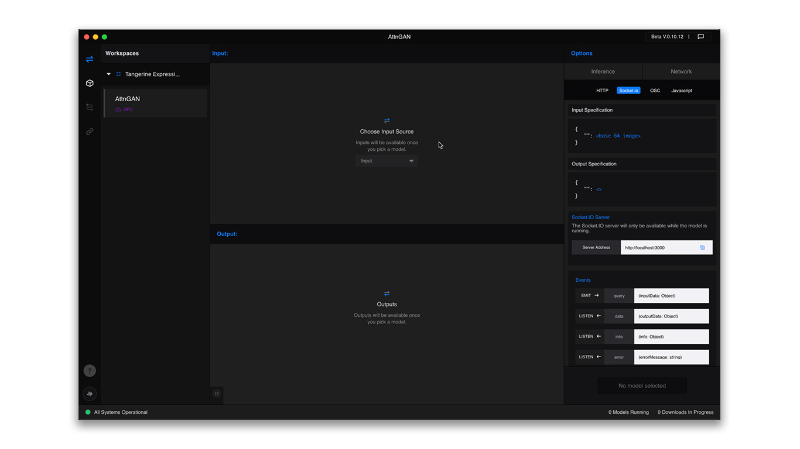
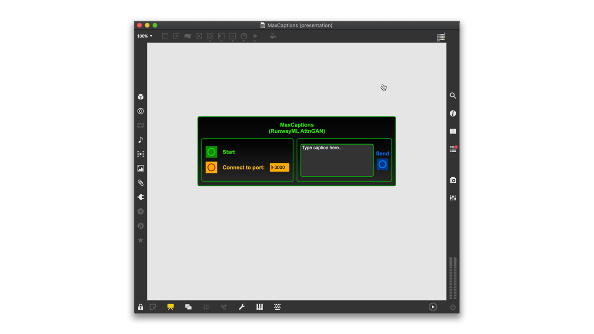
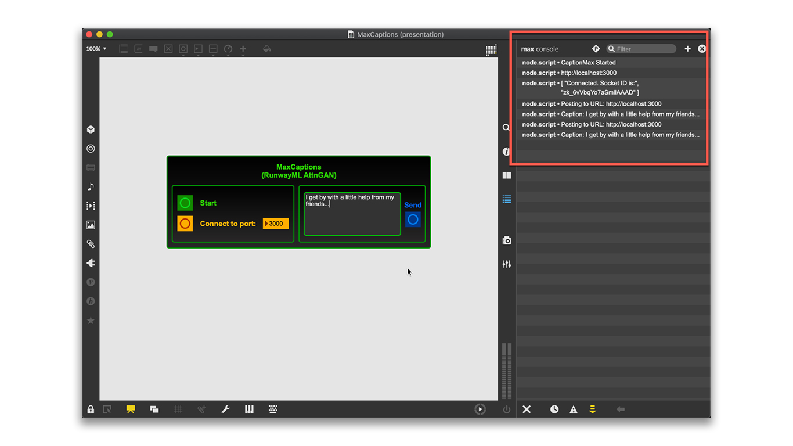
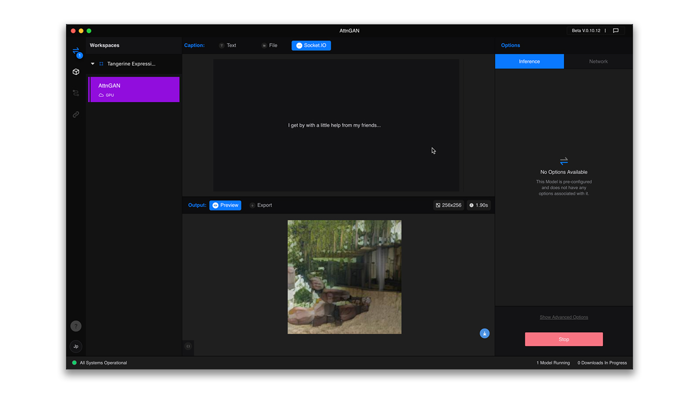
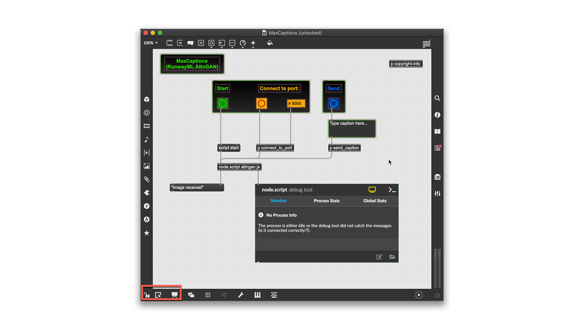

# MaxCaptions

Input captions in Max/MSP and send them to RunwayML to generate synthesized images using **AttnGAN** models.

## Requirements
This example uses the Node for Max API and the Socket.io library to enable real-time communications between Max and RunwayML. Running the example requires:
* Basic knowledge of command line and [git](https://git-scm.com/) commands
* Max 8
* Node.js
* NPM

Node.js and NPM are used extensively for Javascript applications, therefore, there are plenty of installation guides available online. For example: [Get NPM](www.npmjs.com/get-npm)".

## Running the Example

* Make sure you have installed the required software.
* [Clone](https://help.github.com/en/github/creating-cloning-and-archiving-repositories/cloning-a-repository) or download the repository and place ALL the example files at the desired folder location.
* Navigate to the example folder, run the following command, and wait for NPM to install the required packages:

```
$ npm install
```

* Open the RunwayML app, create a workspace, and add the `AttnGAN` model. Click on the `Run Remotely` button and wait for the model to initialize.
* Check the RunwayML Socket.io port under `Network > Socket.io` (Default is port `3000`).



* Open the `MaxCaptions.maxpat` file.
* Click on the `Start` button to initialize the script.
* Make sure the `Port` number box matches the RunwayML Socket.io port. Click on `Connect to Port`.
* Type a caption in the text box and click on `Send`.
 


* Keep an eye on the Max console for helpful messages and errors.



* Check RunwayML and wait for the synthesized image to be displayed.



## Examining the Example

This example is displayed in `Presentation Mode` by default. To examine how this example is built, use the icons at the bottom of the Max window to toggle `Edit Mode` and unlock the patch.


